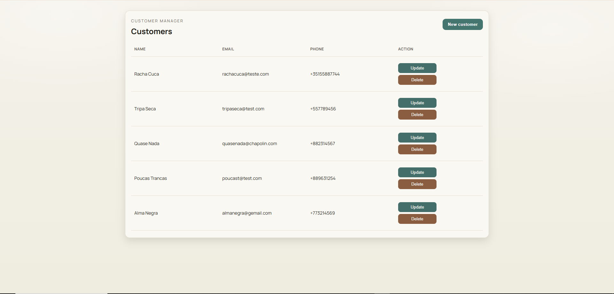
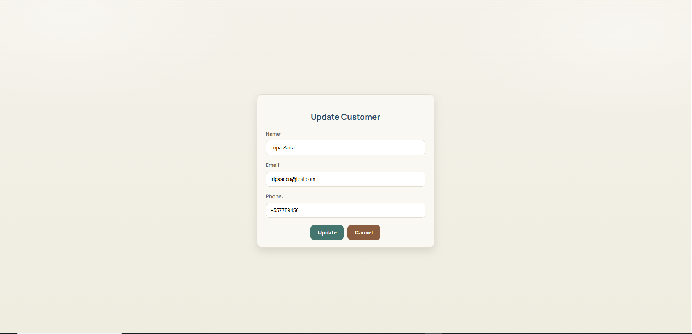
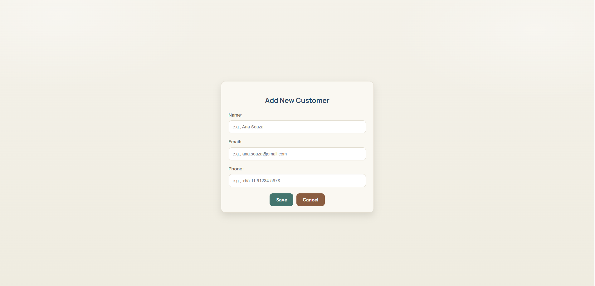

<h1 align="center">Customer Manager App (EN)</h1>

<p align="center">
  <strong>Languages:</strong><br>
  <a href="README.md">Português</a> |
  <a href="README.en.md">English</a>
</p>

The **Customer Manager App** is a **Full Stack** application to manage customers in a simple and modern way.

Manage customers with a modern CRUD, reactive forms, Angular, Spring Boot and PostgreSQL.

---

## **How to Run the Project**

### **Environments**

- **Local:** uses `application-local.properties` and local PostgreSQL.
- **Production:** uses `application-prod.properties` and PostgreSQL on Render (env vars).

### **Prerequisites**

- Java 21
- Node.js 18+
- Angular CLI installed globally (`npm install -g @angular/cli`)
- Running PostgreSQL instance

### **1. Database Setup (Local)**

Create a database in PostgreSQL:

```sql
CREATE DATABASE localhost_customer_manager_app;
```

Local credentials live in `backend/src/main/resources/application-local.properties`.

### **2. Run Backend (Spring Boot)**

From `/backend` directory:

```bash
SPRING_PROFILES_ACTIVE=local mvn spring-boot:run
```

Windows PowerShell:

```powershell
$env:SPRING_PROFILES_ACTIVE="local"; mvn -q -DskipTests spring-boot:run
```

Backend will be available at: `http://localhost:8080/api/customers`

### **3. Run Frontend (Angular)**

From `/frontend` directory:

```bash
npm install
ng serve
```

Frontend will be available at: `http://localhost:4200`

### **Production (Render + Vercel)**

- Backend: Render (Spring Boot + PostgreSQL)
- Frontend: Vercel (Angular)
- Render env vars: `DB_URL`, `DB_USER`, `DB_PASSWORD`, `SPRING_PROFILES_ACTIVE=prod`

## **Project Features**

The **Customer Manager App** provides a complete CRUD with a modern and responsive UI.

### **Main Features**

- **Create Customer**  
  Reactive form with validation and visual feedback.

- **List Customers**  
  Responsive table with action buttons (Update / Delete).

- **Update Customer**  
  Data editing using a pre-filled form by ID.

- **Delete Customer**  
  Instant deletion with automatic list refresh.

- **Modern UI**  
  - Warm Sand theme with light cards  
  - Manrope typography  
  - Buttons with hover and focus effects  
  - Centered and responsive layout  

- **Validation and friendly errors**  
  - Frontend and backend validation  
  - Clear field messages and friendly 400 errors  

## **Screenshots**





## **Technical Learnings**

Throughout this project, several best practices were applied:

- Use of **standalone components** in Angular
- **Reactive Forms** with validation and data patching
- REST integration between **Angular and Spring Boot**
- **CORS** configuration and dynamic routing
- Modern styling and **responsive UX**

## **Contributing**

Contributions are very welcome!
To contribute:

1. Fork the repository
2. Create a branch: `git checkout -b feature/new-feature`
3. Commit your changes following **Conventional Commits**
4. Open a Pull Request

## **License**

This project is licensed under the **MIT** License.

## Author

**Piter Gomes** — Computer Science Student (5th Semester) & Full-Stack Developer

[Email](mailto:piterg.bio@gmail.com) | [LinkedIn](https://www.linkedin.com/in/piter-gomes-4a39281a1/) | [GitHub](https://github.com/pitercoding) | [Portfolio](https://portfolio-pitergomes.vercel.app/)
